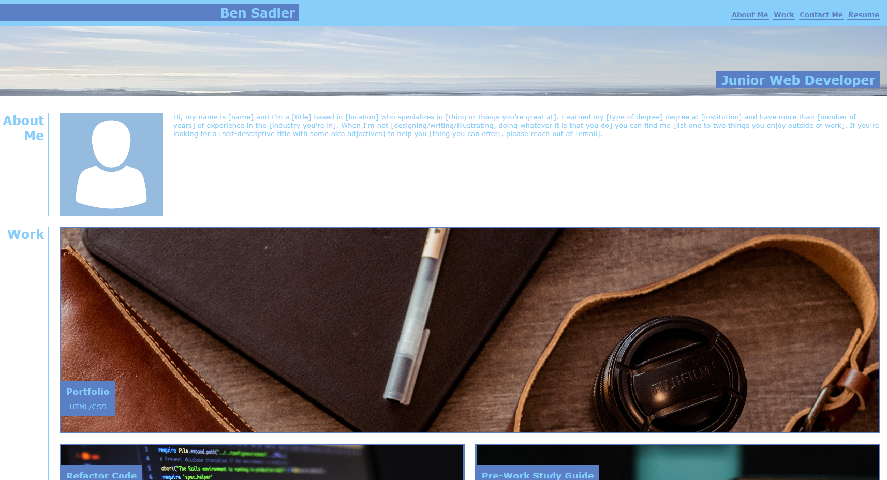

# Ben-Sadler-Portfolio

## Description 

This project requires application of learning from front end web development course to produce a Portfolio webpage from scratch. This includes using HTML & CSS including Flex, Grid and Media Queries attributes to make a responsive site. 

The project User Story & acceptance criteria are as follows:

<ins>User Story </ins>   
AS A Trainee Front End Web developer
I WANT a Portfolio which will showcase me and my Projects
SO THAT potential employers can see what I can do.

<ins>The Acceptance Criteria </ins>  
Here are the critical requirements necessary to develop a portfolio that satisfies a typical hiring manager’s needs:

* When the page is loaded the page presents your name, a recent photo or avatar, and links to sections about you, your work, and how to contact you
* When one of the links in the navigation is clicked then the UI scrolls to the corresponding section
* When viewing the section about your work then the section contains titled images of your applications
* When presented with the your first application then that application's image should be larger in size than the others
* When images of the applications are clicked then the user is taken to that deployed application
* When the page is resized or viewed on various screens and devices then the layout is responsive and adapts to my viewport

The following animation shows the web application's required (similar) appearance and functionality:

<strong>Links</strong>

Website: https://bena251.github.io/Ben-Sadler-Portfolio/  
Website Repository: https://github.com/BenA251/Ben-Sadler-Portfolio

## Usage 

A Marketing agency website homepage, 

The links on top navigation bar can be used to jump to specific sections within homepage.

<strong>Homepage Screenshot:</strong>  

## Credits

Challenge/Project Material was provided by course. 

Images sources (free stock images)

https://www.pexels.com/photo/tumbler-beside-black-dslr-camera-lens-2442888/
https://www.pexels.com/photo/close-up-photo-of-programming-of-codes-546819/
https://www.pexels.com/search/study/
https://www.pexels.com/search/coming%20soon/
https://pixabay.com/vectors/avatar-icon-placeholder-facebook-1577909/

About Me Template

https://static1.squarespace.com/static/55c5193be4b0620bb2eae3e3/t/5e7921780e6b0d31465a907f/1584996728642/PassionToPaid_Resource_AboutMe.pdf 

## License

MIT license

© 2023 edX Boot Camps LLC. Confidential and Proprietary. All Rights Reserved.
